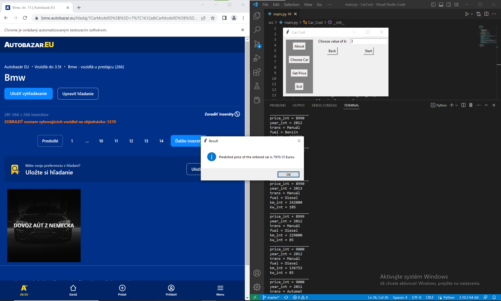

# CarCost
tldr: Quick guide is present in application.

## About
As written in the repository's description this is an application with GUI which is designed to give you an idea of what is your car's value. In order to answer that question it will need data which it gets by on demand scraping the used cars market called www.autobazar.eu. Following it in order to predict your's car value this application offers 2 prediction methods. Those being k-nearest neighbours and neural network based predictor. It is recommended to use k-nearest neighbours if scraped amount of cars from car market is low. Otherwise those 2 methods can produce quite similiar results although the neural network predictor tends to be more sensitive towards it's settings.  

## Requirements to run
As this application is written in Python you will need that installed on your system. GUI is written using Tkinter which should come with Python. The application also uses following libraries which you will need to have installed:
- TensorFlow
- NumPy
- Pandas
- Selenium
## Guide 
1. When you start the application it will also open it's Chrome tab in which the scraper will work. Do not close it. Initial frame of the application also contains quick guide as a faster although less detailed alternative to this guide.

|  | 
|:--:| 
| What you see when you start the application |

2. Then it is time to scrape data from the www.autobazar.eu. In order to do it you have to press *Choose Car* button. After you click it it is time to get, or refresh, the brands and their models offerings on the site. This will also need to be scraped and in order to do so you have to press the *Get/Refresh available brands and models*. After that the application might seem frozen but it is not. It only appears so because the scraper blocks it. After pressing the *Get/Refresh available brands and models* button you should see the following.

|  | 
|:--:| 
| Application scraping available brands and their models |

3. When it is done you have to firstly choose the desired brand of vehicle and then choose the desired model of which value you want to predict. When you have chosen both model and brand you should press the *start scraping* button. It will start scraping all the listings of model you have chosen. You can see it's progress live on the Chrome tab the application has opened with. Again the application might seem frozen during this process but it is not. It only appears so because the scraper blocks it.

|  | 
|:--:| 
| Application scraping all the listings of the chosen model also printing scraped entries into console |

4. After that it is time to predict your car's value. In order to do that start with pressing *Get Price* button. You will see the frame displayed bellow. There you have to choose from which file to predict your cars value (has to be the same brand and model). After that you have to choose your desired prediction method. There are 2 options and for smaller amounts of scraped entries we recommend you to choose *k-nearest neighbours*. Otherwise feel free to choose yourself. Both can yield similiar results. After choosing press *Next* button.

|  | 
|:--:| 
| Application view for selecting from which file to predict price and for choosing prediction method to use |

5. Now it is time to enter specification of the vehicle of which you want to predict price. Just fill all the entries. Note that the options for transmission and for fuel are all the possible values there were to be found in previously specified data file. After you have entered all the values press *Next* button.

|  | 
|:--:| 
| Frame for entering vehicle specification |

6. Now depending on the mehod you have chosen you will see one of two different frames.  

    6.1 If you have chosen *k-nearest neighbours* method you will see the frame displayed bellow. There you have to enter enter *k* value which in this method means that from how many nearest entries in the data will be the price of your vehicle predicted. (Hint: use small odd number such as 3 or 5)
    |  | 
    |:--:| 
    | Frame for entering *k* value for *k-nearest neighbours* method |

    6.2 After filling the *k* value you should press *Start* button. This will start quick prediction process and when it is done you will get window with the result such as shown bellow.
    |  | 
    |:--:| 
    | Prediction has finished and the predicted price is shown in new window |

    6.1 Otherwise if you have chosen *Neural Network* method you will see the frame displayed bellow. There you have to enter two things. First being the architecture of the neural network used as the price predictor. Each number must be greater then zero and represents the number of neurons used in that concrete layer. Therefore the amount of white space separated numbers is the number of layers. The Other thing you need to enter is number of epochs for the predictor to be trained for. Then you can press *Start* button.
    |  | 
    |:--:| 
    | Prediction has finished and the predicted price is shown in new window |

    6.2 
    After pressing it the predictor will start learning and after it is learned it will predict the cost of the car you have entered. You will obtain the result in the same way as you would with the *k-nearest neighours* method. That is via a window with the result as shown bellow.
    |  | 
    |:--:| 
    | Prediction has finished and the predicted price is shown in new window |

7. Now just press the *Ok* button and if you are finished you can exit the program by clicking the *Exit* button.

Note that if you enter somewhere invalid value the application will stop you and force you to enter some correct one before allowing you to proceed.
    
  
  
By Samuel Mintál