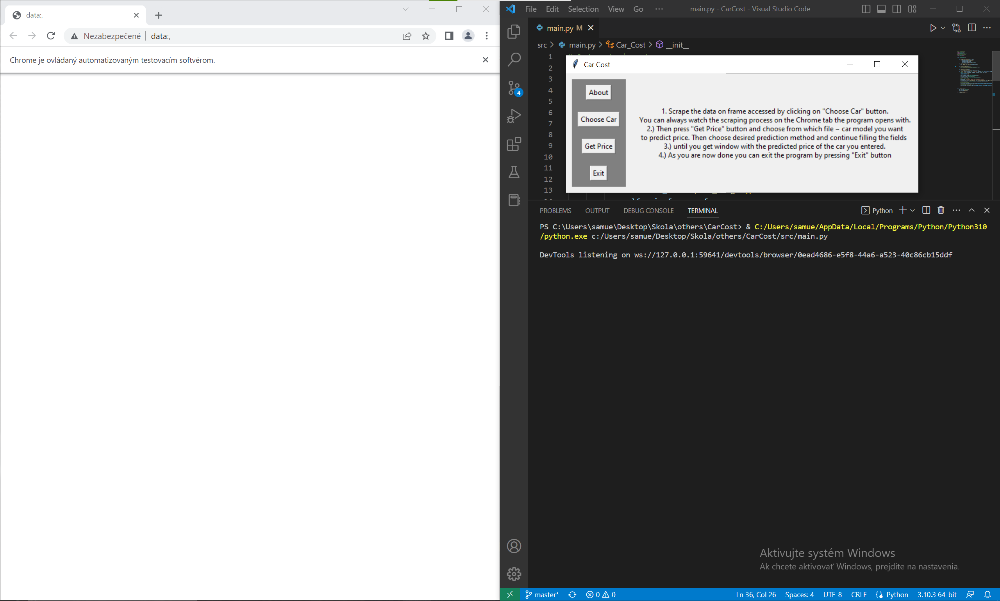

# CarCost
tldr: Quick guide is present in application.

## About
As written in the repository's description this is an application with GUI which is designed to give you an idea of what is your car's value. In order to answer that question it will need data which it gets by on demand scraping the used cars market called www.autobazar.eu. Following it in order to predict your's car value this application offers 2 prediction methods. Those being k-nearest neighbours and neural network based predictor. It is recommended to use k-nearest neighbours if scraped amount of cars from car market is low. Otherwise those 2 methods can produce quite similiar results although the neural network predictor tends to be more sensitive towards it's settings.  

## Requirements to run
As this application is written in Python you will need that installed on your system. GUI is written using Tkinter which should come with Python. The application also uses following libraries which you will need to have installed:
- TensorFlow
- NumPy
- Pandas
- Selenium
## Guide 
1. When you start the application it will also open it's Chrome tab in which the scraper will work. Do not close it. Initial frame of the application also contains quick guide as a faster although less detailed alternative to this guide.

|  | 
|:--:| 
| What you see when you start the application |

2. Then it is time to scrape data from the www.autobazar.eu. In order to do it you have to press *Choose Car* button. After you click it it is time to get, or refresh, the brands and their models offerings on the site. This will also need to be scraped and in order to do so you have to press the *Get/Refresh available brands and models*. After that the application might seem frozen but it is not. It only appears so because the scraper blocks it. After pressing the *Get/Refresh available brands and models* button you should see the following.

|  | 
|:--:| 
| Application scraping available brands and their models |

3. When it is done you have to firstly choose the desired brand of vehicle and then choose the desired model of which value you want to predict. When you have chosen both model and brand you should press the *start scraping* button. It will start scraping all the listings of model you have chosen. You can see it's progress live on the Chrome tab the application has opened with. Again the application might seem frozen during this process but it is not. It only appears so because the scraper blocks it.

|  | 
|:--:| 
| Application scraping all the listings of the chosen model also printing scraped entries into console |

By Samuel Mintál